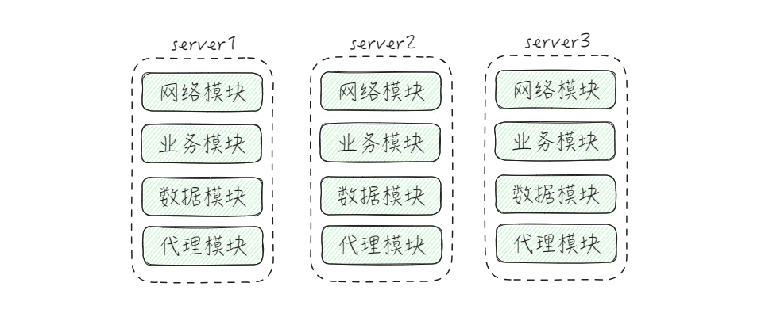
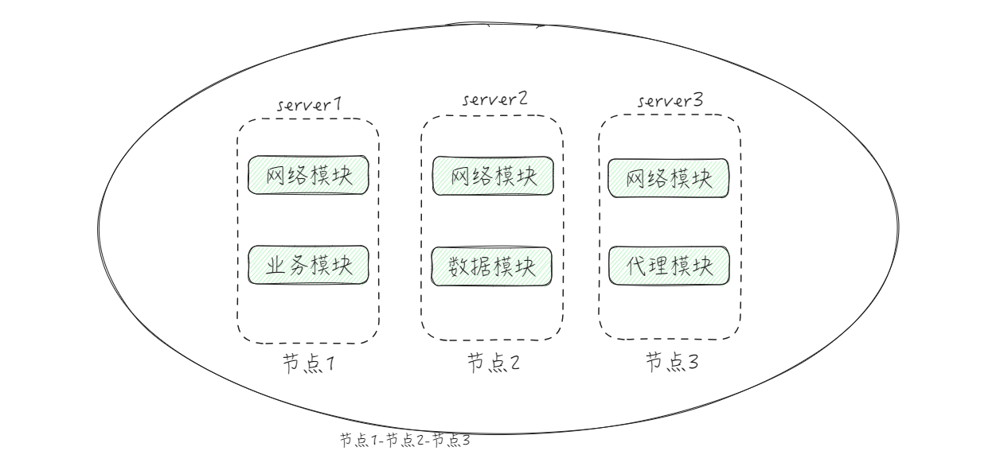
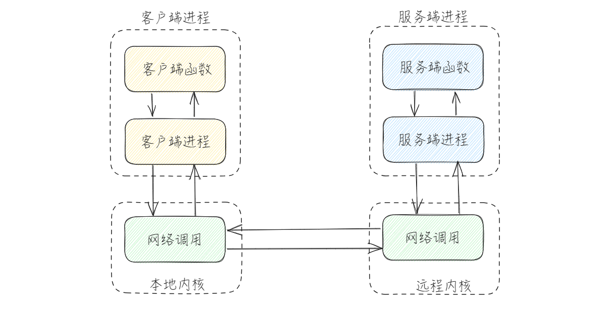
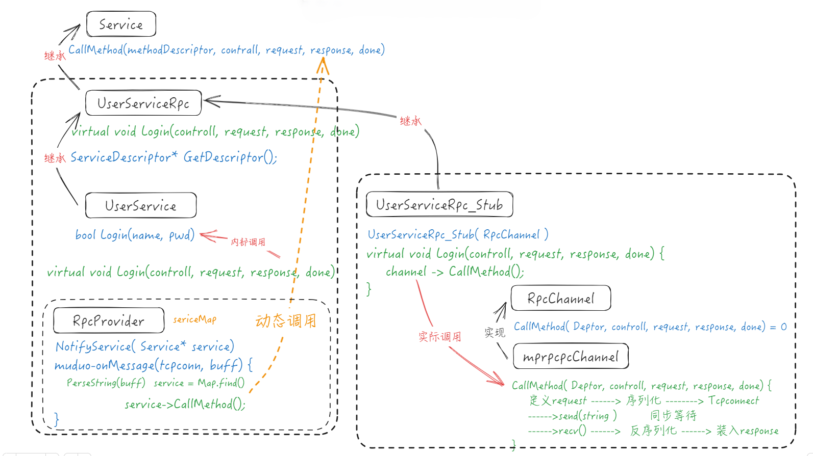

# MP-RPC项目

分布式网络通信`框架`

## 集群 和 分布式

回想以往的webserver项目，仅仅是在一个机器上部署，这样就会引起多种问题：
+ 受硬件的限制，server的并发量可能并不会很高。
+ 修改一个模块可能会导致整个项目重新编译，重新部署。
+ 不同模块对硬件有不同的需求。

### 集群



当我们有多台服务器，每一台服务器都单独运行一个完整的server时，靠着数量的累计，用户的并发量将会提升，但是单个服务器上的问题并没有解决。

### 分布式



一个完整的server包含多个功能模块，有些模块是必要的，需要高并发，就将其部署在大多数服务器上，有些模块并不需要高并发，只要部署在一个或少部分服务器上，这样就可以根据不同的模块搭配适合他们的机器。

分布式的部署方法也会有对应的问题：
+ 如何划分不同的模块部署。
+ 不同的服务器，不同的进程，如何调用对方(不同进程)的模块。——RPC远程调用

## RPC远程调用

在以往的项目中，我们所定义的函数方法只是在同一个进程，也只能在同一个进程内调用。现在我们想通过某种方式，使得在不同的进程，甚至在不同的机器上调用到这个函数，这就是RPC。




### 1.写出本地方法/函数

首先我们使用C++C++写一个本地的方法：

```C++
class UserService {
public:
    //本地方法：登录
    bool Login(std::string name, std::string pwd) {
        std::cout << "call local service : Login" << std::endl;
        std::cout << "name : " << name << std::endl;
        std::cout << "pwd  : " << pwd  << std::endl;
        return true;
    }
};
```

这是一个关于User用户的服务，它提供一个本地方法`bool Login(std::string name, std::string pwd)`。（只考虑背景，不在乎具体实现）

在进程内它可以顺利的运行，但想要在进程外的其他进程调用它是不可能的。这时我们应该考虑的是如何在两个进程间进行通信，此时，为了频繁的来往以及可用性考虑，首选socket，而它代表的便是网络通信。

在两个进程可以进行通信的前提下，要想调用其他进程的函数，我们应该要知道哪些信息，换句话说我们要如何通过 `进程 --> 类 --> 函数/方法 --> 函数体` 这样的结构，因此这些信息都要有所标识。

如果要我们从零开始来设计这样的框架，那是不现实的，我们人类的一大特点便是合理的运用工具。google所提供的`protobuf`就是一个非常好的工具。它为我们提供了大量rpc相关的功能。

### 2.使用protobuf来描述服务

当我们用户想要把本地服务变成可分布式部署的远程RPC服务：首先要写出描述这个RPC方法的**方法名，参数类型，返回值类型**等。(通过Protobuf来定义生成)

```proto
//自定义 返回码 消息类型
message ResultCode {
    int32 errcode = 1;
    bytes errmsg = 2;
}

/* Login */
//自定义 登录请求 消息类型
message LoginRequest {
    bytes name = 1; //姓名
    bytes pwd = 2; //密码
    //map<int32, string> test = 3;
}

//自定义 登录响应 消息类型
message LoginResponse {
    ResultCode result = 1; //返回码
    bool sucess = 2; //成功与否
}

//自定义服务 用户服务的rpc框架
service UserServiceRpc {
    //参数：登录请求    返回值：登录回应   
    rpc Login(LoginRequest) returns(LoginResponse);

}

```
使用以下命令便可以生成对应的h和cc文件
```bash
protoc user.proto --cpp_out=./
```

这样就生成了描述这个服务的相关类，这一部分是工具为我们生成的，但这一部分需要我们合理的定义描述信息。

### 3.将本地服务变为RPC服务

将我们刚才写的类修改，让其继承来自生成的h文件中对应的Rpc类，同时重写其中的`void Login(RpcController* ,LoginRequest* ,LoginResponse* ,Closure*)`。这样当框架上传参数，将其调用后，就会间接调用本地方法。

```C++
class UserService : public fixbug::UserServiceRpc {
public:
    //本地方法：登录
    bool Login(std::string name, std::string pwd) {
        std::cout << "call local service : Login" << std::endl;
        std::cout << "name : " << name << std::endl;
        std::cout << "pwd  : " << pwd  << std::endl;
        return true;
    }

    //重写UserServiceRpc中的虚函数Login，这将会是框架直接调用的方法 
    void Login(::google::protobuf::RpcController* controller,
                        const ::fixbug::LoginRequest* request,
                            ::fixbug::LoginResponse* response,
                            ::google::protobuf::Closure* done) {
        /*框架给业务上报了请求参数LoginRequest，业务获取相应的数据完成本地业务。*/
        //根据请求获取数据
        std::string name = request->name();
        std::string pwd = request->pwd();
        
        //完成本地业务
        bool login_result = Login(name, pwd); //本地业务

        //响应的写入
        fixbug::ResultCode* code = response->mutable_result();
        code->set_errcode(0);
        code->set_errmsg("no error");
        response->set_sucess(login_result);
        
        //调用回调
        done->Run(); //执行响应消息的数据序列化以及网络发送。
    }
};
```

在重写的方法内，分为几个步骤：
+ 根据LoginRequest获取参数数据。
+ 根据参数调用本地方法，保存返回值。
+ 根据LoginResponse定义响应，根据返回值填写响应的内部数据。
+ 调用回调。

这样，一个可发布的RPC服务基础便已设计完成。

### 4.保存并发布RPC服务

设计一个Provider来集中管理我们要发布的服务及其信息，同时根据网络收发获取请求的描述信息，以此来调用对应的方法。

```C++
//用于发布rpc服务的网络对象类
class RpcProvider {
public:
    //通知，这是框架提供给外部使用的，发布rpc方法的函数接口。
    void NotifyService(google::protobuf::Service* service); // 接受任意的业务，因此将它们的抽象类作为参数。

    //启动rpc服务节点，开始提供rpc远程调用服务
    void Run();
    
private:
    //连接回调
    void OnConnection(const muduo::net::TcpConnectionPtr& conn);
    //读写回调
    void OnMessage(const muduo::net::TcpConnectionPtr& conn, muduo::net::Buffer* buffer, muduo::Timestamp ts);

    //Closure的回调，用于序列化rpc的响应和网络发送
    void SendRpcResponse(const muduo::net::TcpConnectionPtr& conn, google::protobuf::Message* response);

private:
    //std::unique_ptr<muduo::net::TcpServer> m_tcpserverPtr;//用于网络的muduo-tcpserver网络服务器。
    muduo::net::EventLoop m_eventLoop; // 用于事件循环的loop对象。

    //service服务类型信息
    struct ServiceInfo {
        google::protobuf::Service* m_service;                                               // 保存服务对象
        std::unordered_map<std::string, const google::protobuf::MethodDescriptor*> m_methodMap;   // 保存服务方法
    };
    std::unordered_map<std::string, ServiceInfo> m_serviceMap; // 存储注册成功的服务对象及其方法和信息
};

/**
 * service_name ==> service描述 ==> service* 记录服务对象 ==> (method_name >> method方法对象)
 */

//通知，这是框架提供给外部使用的，发布rpc方法的函数接口。
void RpcProvider::NotifyService(google::protobuf::Service* service) {
    ServiceInfo service_info;

    //获取服务对象的描述信息
    const google::protobuf::ServiceDescriptor* pserviceDesc = service->GetDescriptor();
    
    //获取服务名称
    std::string service_name = pserviceDesc->name();
    
    LOG_INFO("service_name : %s", service_name.c_str()); //std::cout << "service_name : " << service_name << std::endl;

    //获取服务对象的方法的数量
    int methodCnt = pserviceDesc->method_count();
    //循环获取服务对象的方法 并将其进行保存
    for (int i = 0; i < methodCnt; i++) {
        //获取服务对象指定下标的服务方法的描述（抽象描述）
        const google::protobuf::MethodDescriptor* pmethodDesc = pserviceDesc->method(i);
        //获取服务对象的方法的名称
        std::string method_name = pmethodDesc->name();

        LOG_INFO("method_name : %s", method_name.c_str()); //std::cout << "method_name : " << method_name << std::endl;

        //添加方法
        service_info.m_methodMap.insert({method_name, pmethodDesc});
    }
    service_info.m_service = service;

    m_serviceMap.insert({service_name, service_info}); // 添加服务对象到服务对象表

}

//启动rpc服务节点，开始提供rpc远程调用服务
void RpcProvider::Run() {
    std::string ip = MprpcApplication::GetInstance().GetConfig().Load("rpcserverip");
    uint16_t port = atoi(MprpcApplication::GetInstance().GetConfig().Load("rpcserverport").c_str());
    muduo::net::InetAddress address(ip, port);

    //创建tcpserver
    muduo::net::TcpServer server(&m_eventLoop, address, "RpcProvider");
    //绑定【连接回调】和【消息读写回调】方法------分离了网络代码和业务代码
    server.setConnectionCallback(std::bind(&RpcProvider::OnConnection, this, std::placeholders::_1));
    server.setMessageCallback(std::bind(&RpcProvider::OnMessage, this, std::placeholders::_1
                                                                     , std::placeholders::_2
                                                                     , std::placeholders::_3));
    //设置muduo库线程池线程数量
    server.setThreadNum(4);
    //启动网络服务
    std::cout << "" << ip << " port : " << port << std::endl;
    LOG_INFO("RpcProvider start service at ip : %s port : %d", ip.c_str(), port);
    server.start();
    m_eventLoop.loop();

}

//连接回调
void RpcProvider::OnConnection(const muduo::net::TcpConnectionPtr& conn) {
    if (!conn->connected()) {
        //连接已断开
        conn->shutdown();
    }
}

/**
 * RpcProvider和RpcConsumer协商好之间的通信用的protobuf数据类型。
 * service_name
 * method_name
 * args_size
 * args
 * 
 * header_size(4字节) + header_str + args_str
 * 二进制
 */

//读写回调
void RpcProvider::OnMessage(const muduo::net::TcpConnectionPtr& conn, muduo::net::Buffer* buffer, muduo::Timestamp ts) {
    //接收到的rpc远程调用的字符流
    std::string recv_buff = buffer->retrieveAllAsString();

    //提取前4个字节
    uint32_t header_size = 0;
    recv_buff.copy((char*)&header_size, 4, 0);
    //根据header_size提取header_str数据
    std::string rpc_header_str = recv_buff.substr(4, header_size);

    mprpc::RpcHeader rpcHeader;
    std::string service_name;   // ++++++
    std::string method_name;    // ++++++
    uint32_t args_size;         // ++++++
    if (rpcHeader.ParseFromString(rpc_header_str)) {
        //反序列化成功
        service_name = rpcHeader.service_name();
        method_name = rpcHeader.method_name();
        args_size = rpcHeader.args_size();
    }
    else {
        //反序列化失败
        std::cout << "rpc_header_str : " << rpc_header_str << "Parse ERROR!" << std::endl;
        return;
    }

    //获取参数数据
    std::string args_str = recv_buff.substr(4 + header_size, args_size);

    //获取service
    auto iter = m_serviceMap.find(service_name);
    if (iter == m_serviceMap.end()) {
        std::cout << service_name << " is not exist!" << std::endl;
        return;
    }

    google::protobuf::Service* service = iter->second.m_service;        //获取服务对象

    //获取method
    auto miter = iter->second.m_methodMap.find(method_name);
    if (miter == iter->second.m_methodMap.end()) {
        std::cout << service_name << " : " << method_name << " is not exist!" << std::endl;
        return;
    }

    const google::protobuf::MethodDescriptor* method = miter->second;   // 获取方法

    //生成rpc方法调用的请求和响应参数
    google::protobuf::Message* request = service->GetRequestPrototype(method).New();
    if (!request->ParseFromString(args_str)) {
        std::cout << "request Parse ERROR!" << " args_str : " << args_str << std::endl;
    }
    google::protobuf::Message* response = service->GetResponsePrototype(method).New();
    // if (!0){

    // }

    //为method方法的回调绑定一个Closure的回调函数
    google::protobuf::Closure* done = 
            google::protobuf::NewCallback<RpcProvider, const muduo::net::TcpConnectionPtr&, google::protobuf::Message*>
                                         (this, &RpcProvider::SendRpcResponse, conn, response);

    //根据远端rpc请求，调用当前节点发布的方法
    service->CallMethod(method, nullptr, request, response, done);

}

//Closure的回调，用于序列化rpc的响应和网络发送
void RpcProvider::SendRpcResponse(const muduo::net::TcpConnectionPtr& conn, google::protobuf::Message* response) {
    std::string response_str;
    // 对response进行序列化
    if (response->SerializeToString(&response_str)) {
        // 序列化成功，将rpc执行的结果发送给调用方
        conn->send(response_str);
    }
    else {
        std::cout << "serialize response_str ERROR!" << std::endl;
    }

    conn->shutdown(); // 主动断开连接
}

```

我们可以看到的是，在`Run()`中使用了muduo库，进行构建网络部分的功能。同时在内部使用`unordered_map`来保存服务相关的描述，这样可以方便我们存储，同时可以快速查找到对应的服务和方法。

在provider中，当集齐所有的参数时，会调用`CallMethod()`，然而，它到底指向哪？就需要RpcChannel来解释。

### 5.集中处理方法的调用

Channel在这里不应该理解为通道，应该理解为代理。

```C++
class MprpcChannel : public google::protobuf::RpcChannel {
public:
    //所有通过stub代理的rpc方法都要经过这里，集中统一进行序列化以及网络发送
    void CallMethod(const google::protobuf::MethodDescriptor* method,
                    google::protobuf::RpcController* controller,
                    const google::protobuf::Message* request,
                    google::protobuf::Message* response,
                    google::protobuf::Closure* done);
};


void MprpcChannel::CallMethod(const google::protobuf::MethodDescriptor* method,
                              google::protobuf::RpcController* controller,
                              const google::protobuf::Message* request,
                              google::protobuf::Message* response,
                              google::protobuf::Closure* done) {
    //获取服务名和方法名
    const google::protobuf::ServiceDescriptor* sd = method->service();
    std::string service_name = sd->name();          // service_name +
    std::string method_name = method->name();       // method_name  +

    //获取参数序列化字符串长度 args_size
    uint32_t args_size = 0;
    std::string args_str;
    if (request->SerializeToString(&args_str)) {
        // 序列化成功  
        args_size = args_str.size();                // args_size    +
    }
    else {
        controller->SetFailed("serialize request error!");
        return;
    }

    //定义rpc请求的header
    mprpc::RpcHeader rpcHeader;                     // rpcHeader
    rpcHeader.set_service_name(service_name); // -
    rpcHeader.set_method_name(method_name);   // -
    rpcHeader.set_args_size(args_size);       // -

    uint32_t header_size = 0;
    std::string rpc_header_str;
    if (rpcHeader.SerializeToString(&rpc_header_str)) {
        header_size = rpc_header_str.size();        // header_size  rpc_header_str
    }
    else {
        // 序列化失败
        controller->SetFailed("serialize rpcHeader error!");
        return;
    }


    /**合成rpc请求的字符串
     * send_rpc_str {
     *      header_size
     *      rpc_header_str {
     *          service_name
     *          method_name
     *          args_size
     *      }
     *      args_str
     * }
     * 注：header_size 4字节
     */
    std::string send_rpc_str;
    send_rpc_str.insert(0, std::string((char*)&header_size, 4));    // header_size
    send_rpc_str += rpc_header_str;                                 // rpc_header_str
    send_rpc_str += args_str;                                       // args_str

    /**使用tcp，完成rpc方法的远程调用*/
    int clientfd = socket(AF_INET, SOCK_STREAM, 0);
    if (clientfd == -1) {
        char errtxt[512] = {0};
        sprintf(errtxt, "socket error! errno : %d", errno);
        controller->SetFailed(errtxt);
        return;
    }

    //从配置文件获取ip和端口
    std::string ip = MprpcApplication::GetInstance().GetConfig().Load("rpcserverip");
    uint16_t port = atoi(MprpcApplication::GetInstance().GetConfig().Load("rpcserverport").c_str());

    //地址
    struct sockaddr_in server_addr;
    server_addr.sin_family = AF_INET;
    server_addr.sin_port = htons(port);
    server_addr.sin_addr.s_addr = inet_addr(ip.c_str());

    //连接服务节点
    if (connect(clientfd, (struct sockaddr*)&server_addr, sizeof(server_addr)) == -1) {
        //连接失败
        close(clientfd);
        controller->SetFailed("connect error!");
    }

    //发送rpc请求
    if (send(clientfd, send_rpc_str.c_str(), send_rpc_str.size(), 0) == -1) {
        //发送失败
        close(clientfd);
        controller->SetFailed("send error!");
        return;
    }

    //接收rpc响应
    char recv_buff[1024] = {0};
    int  recv_size = 0;
    if ((recv_size = recv(clientfd, recv_buff, 1024, 0)) == -1) {
        //接收失败
        close(clientfd);
        controller->SetFailed("recv error!");
        return;
    }

    //反序列化rpc响应数据
    std::string response_str(recv_buff, 0, recv_size);
    if (!response->ParseFromString(response_str)) {
        //反序列化失败
        close(clientfd);
        char errtxt[1024] = {0};
        sprintf(errtxt, "parse recv_buff error! errno : %s", recv_buff);
        controller->SetFailed(errtxt);
        return;
    }

    close(clientfd);
}

```

### 6.提供方发布服务

到了这里服务方已经完成了大多数功能，这样就可以发布了：

```C++
int main(int argc, char** argv) {
    //调用框架的初始化操作
    MprpcApplication::Init(argc, argv);

    //调用发布
    RpcProvider provider;
    provider.NotifyService(new UserService());

    //启动
    provider.Run();

    return 0;
}
```

是不是非常简短，但其背后的逻辑是值得一究的。

### 7.调用方调用

当我们以调用者的视角来使用，我们会发现也非常简单。

```C++
int main(int argc, char** argv) {
    //初始化框架
    MprpcApplication::Init(argc, argv);

    //定义stub代理
    fixbug::UserServiceRpc_Stub stub(new MprpcChannel());

    /*例：调用rpc方法Login*/

    //请求
    fixbug::LoginRequest request;
    request.set_name("hankangkai");
    request.set_pwd("Itcast66^");
    //响应
    fixbug::LoginResponse response;

    //调用
    stub.Login(nullptr, &request, &response, nullptr);

    //完成一次调用，读取调用结果
    if(response.result().errcode() == 0) {
        std::cout << "rpc login response success : " << response.sucess() << std::endl;
    }
    else {
        std::cout << "rpc login response ERROR : " << response.result().errmsg() << std::endl;
    }
}

```

## RPC调用过程剖析

了解了整体的设计之后，让我们理清整个过程。如图：



在整个框架中最难理解的是由protobuf生成的部分，其中包括`Service`，`UserServiceRpc`，`UserServiceRpc_Stub`，`RpcChannel`这几个类。

当我们的服务类`UserService`继承自`UserServiceRpc`之后，重写`void Login(RpcController*, LoginRequest*, LoginResponse*, Closure*)`这个虚函数。在函数中：
1. 通过`LoginRequest*`的参数来获取我们需要的参数。
2. 调用本地`bool Login(param)`，并保存调用结果和返回值(如果有的话)。
3. 通过`LoginResponse*`定义响应，并将调用结果以及返回值填入响应。
4. 通过`Closure*`来调用`Run()`回调。

同样的，`UserServiceRpc_Stub`也继承自`UserServiceRpc`，其中有一个重要的构造函数`UserServiceRpc_Stub(RpcChannel*)`，必须要传入`RpcChannel*`对象，同样也重写`void Login(RpcController*, LoginRequest*, LoginResponse*, Closure*)`这个虚函数，其中需要`RpcChannel`对象调用`CallMethod()`函数。

然而，`RpcChannel`是一个抽象类，必须继承实现，因此我们的集中代理类`MprpcChannel`继承自`RpcChannel`并重写`CallMethod(MethodDescriptor*, RpcController*, LoginRequest*, LoginResponse*, Closure*)`这个函数，在函数中：
1. 通过`MethodDescriptor*`来获取服务名，方法名等
2. 通过`LoginRequest*`序列化获取参数字符串。
3. 根据服务名，方法名，参数字符串来构建用于网络传输的发送字符串。
4. 定义socket与地址类型，使用`connect()`连接目标地址，并发送字符串。
5. 调用`recv()`阻塞等待来接收数据。
6. 通过`LoginResponse*`定义响应，并将接收到的数据反序列化为响应。

根据多态，`RpcChannel`对象调用`CallMethod()`函数将会动态改为`MprpcChannel`对象调用`CallMethod()`函数。

在提供方，最重要的是`RpcProvider`这个类，其中有个unordered_map存储服务的相关信息，另外有`void NotifyService(Service*) `这个函数，它接收任意的业服务，因此将它们的抽象类作为参数，其中：
1. 通过调用`GetDescriptor()`来获取服务对象的描述信息。
2. 根据服务信息获取服务名以及服务对应的所有方法名和方法的描述信息。
3. 将这些信息添加到Map表中。

另外，定义了一个`void Run()`函数，其中根据muduo库快速创建一个服务端，并确定**连接回调**和**消息回调**OnMessage()，在消息回调中：
1. 根据接收到的数据以及固定格式解析出服务名，方法名，参数列表。
2. 根据服务名和方法名在Map中找到对应的方法描述。
3. 定义出相应的请求和响应。
4. 将找到的服务调用`CallMethod()`。

这样整个框架和调用关系就很清晰了。

## RPC使用示例

```C++
//提供方
int main(int argc, char** argv) {
    //调用框架的初始化操作
    MprpcApplication::Init(argc, argv);

    //调用发布
    RpcProvider provider;
    provider.NotifyService(new UserService());

    //启动
    provider.Run();

    return 0;
}

//使用方
int main(int argc, char** argv) {
    //初始化框架
    MprpcApplication::Init(argc, argv);

    //定义stub代理
    fixbug::UserServiceRpc_Stub stub(new MprpcChannel());

    /*例：调用rpc方法Login*/

    //请求
    fixbug::LoginRequest request;
    request.set_name("hankangkai");
    request.set_pwd("Itcast66^");
    //响应
    fixbug::LoginResponse response;

    //调用
    stub.Login(nullptr, &request, &response, nullptr);

    //完成一次调用，读取调用结果
    if(response.result().errcode() == 0) {
        std::cout << "rpc login response success : " << response.sucess() << std::endl;
    }
    else {
        std::cout << "rpc login response ERROR : " << response.result().errmsg() << std::endl;
    }

    return 0;
}    

```

## 总结

rpc是为了跨进程调用函数，在本质上还是使用socket跨进程通信，只不过交流的数据格式更加的复杂，但是通过protobuf这个rpc以及序列化就可以简化设计，快速实现。